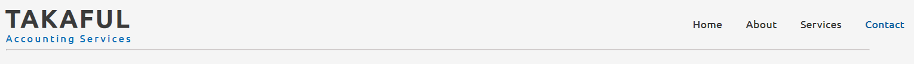
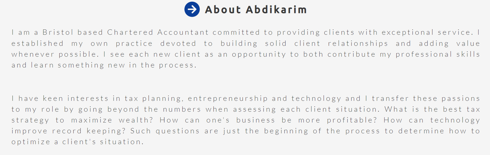
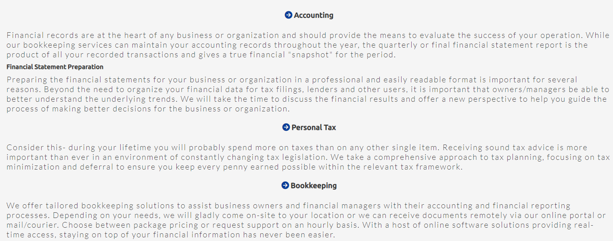
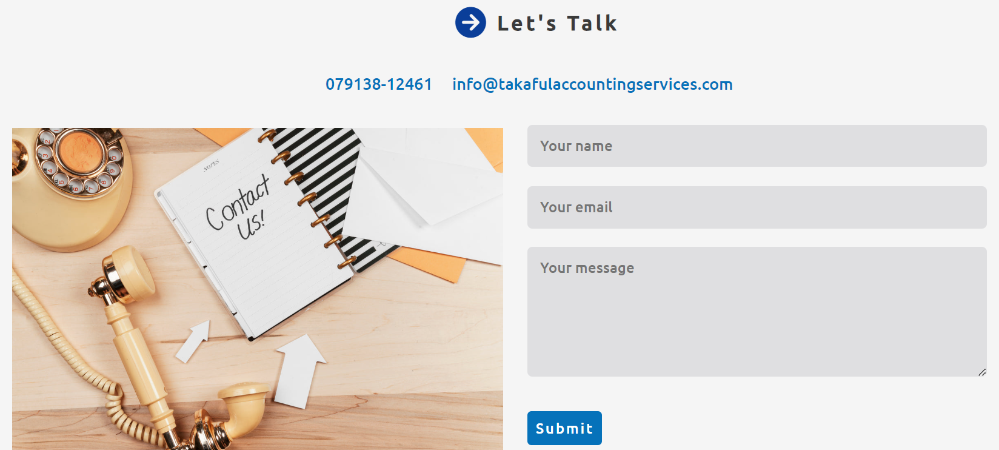
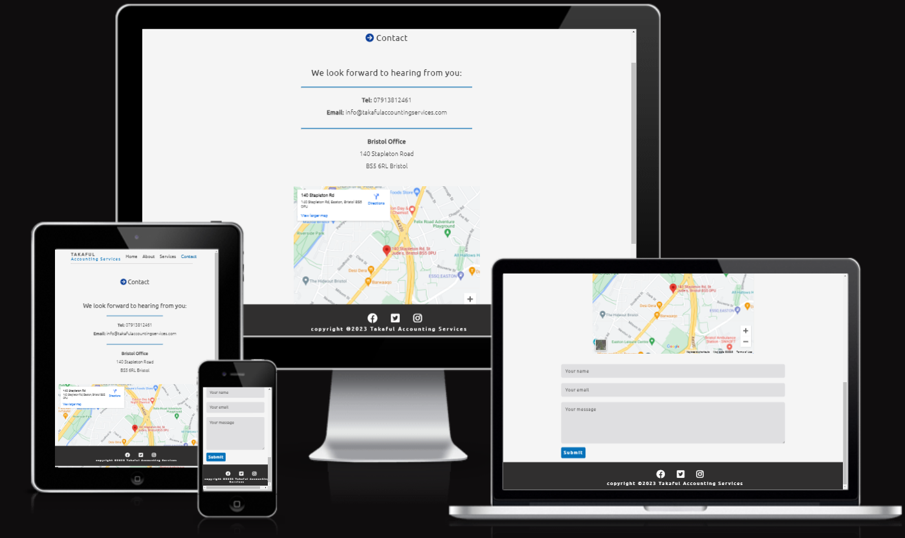
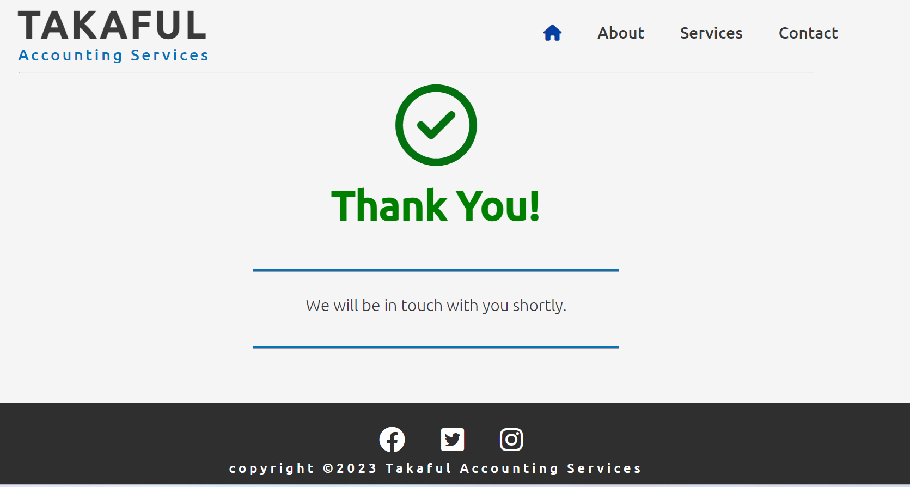
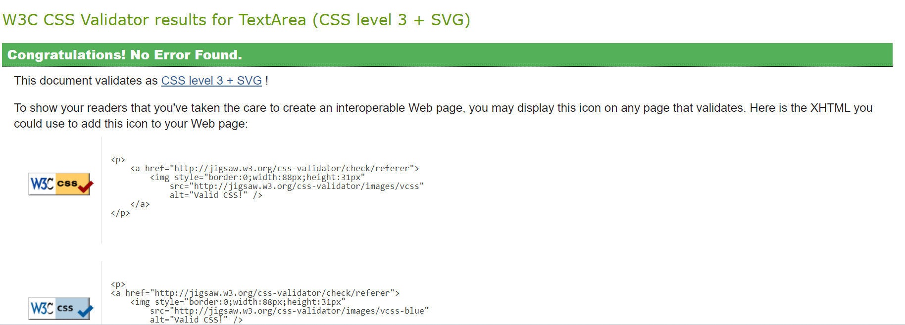
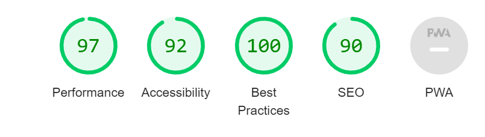
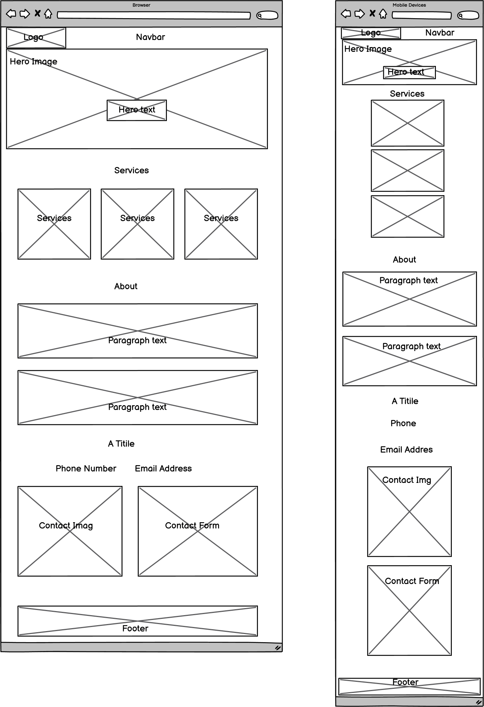

### Takaful Accounting Services
***
[Takaful Accounting Services](https://ibrahim-y-adam.github.io/project-one/) is an accounting website for small businesses and individuals. 

Here you can find Accounting, Personal Tax, and Bookkeeping.

***
#### Technologies used

* HTML
* CSS
* Font Awesome icons
* Google fonts

***

#### User Stories

* As a first-time visitor, I want to understand the website and finding more about the Accountant.

* As a first-time visitor, I want easily navigate through the website, so I can find the information I am looking for.

* As a first-time visitor, I want to see the information about the services. So I can learn more about them.

* As a user, I want the website to have a contact form page, in which I can contact them.

* As a mobile device user, I want the website to be responsive, so I can use my phone or tablet to visit it.
  

***
#### Features
##### Home Page
* Navigation 

    * Positioned at the top of the page
    * Contains logo of the website at the left corner
    * On the right side, there are navigation links: 
        * Home - leads to the virtual tour page.
        * About - leads to the Accountant page.
        * Services - leads to the services page
        * Contact - leads to the contact form page
    * The link page that the user is currently on is colored.
    * The links have an animated underline effect.
    * The navigation is transparent and easy to understand.

    

***
* Hero Section

    * Hero section has a background image.
    * Hero section shows a title and a button in the middle of the screen.
        * It has the name of the company
        * It tells the user what the company is offering.
        * It shows a button you can click and lead you to the contact form page.

            

***

* About Section

    * About section contains paragraphs of text
    * About section provides information about the Accounting company.
    *About section tells the user why they should consider choosing the accountant for their business.

    

***

##### Services
* This section contains all the service that the company is providing which are:
    * Accounting.
    * Personal Tax.
    * Bookkeeping.
         

***

* Let's Talk section
    * Let's Talk section has a background image and a form.
    * The form has three elements:
        * It has a user name input
        * It has an email input
        * it has a textarea box
        * it has a submit button.

    

***

* Footer

    * Footer contains social media links that open in a new tab.
    * Social media links are animated on hover.
    * Under the social media links. There is a copyright sign with the website title.

    

***

* Contact Page

    * This page has a contact form: 
        * All text input fields are customized.
        * The inputs have placeholder info.
        * The submit button is animated on hover.
    * This page has a map that gives you the address.
    * The page is responsive and looks good on all usual screen sizes.
    * Submitting the form leads to the hidden response page that contains thank you message.

    
    

***

##### Testing

* I tested that the website works in all browsers: Chrome, Microsoft Edge, and Firefox.
* I used devtools to confirm that the website is responsive, looks, and functions as it is supposed to on all standard screen sizes.
* I tested all the links and confirmed that all of them are working and leading where they are supposed to.

##### Bugs
* Solved bugs
    * I found out that on mobile devices, the image and form on the contact page are not vertically centered as I supposed.
    * I fixed it, by using the CSS property display flex and adjected the height.

***

* Unsolved bugs
    * None.
***

##### Validator testing

* HTML 
    * No errors or warnings were found when passing through the official W3C validator.
    

* CSS
    * No errors or warnings were found when passing through the official W3C CSS Validator.
    
* Accessibility and Performance
    * Using lighthouse in devtools, I confirmed that the website is performing well, and accessible, and the colors and fonts chosen are readable.

    

***

* Deployment 
    * The website is deployed to GitHub pages and can be accessed by the link: [Takaful Accounting Services](https://ibrahim-y-adam.github.io/project-one/)

***
##### Credits

* Content 
    * The code to make social media links is taken from the Code Institute Love Running project and modified to fit my website.

* Media
    * All the images for the website are taken from [Unplash](https://unsplash.com/)

***

##### Wireframes

